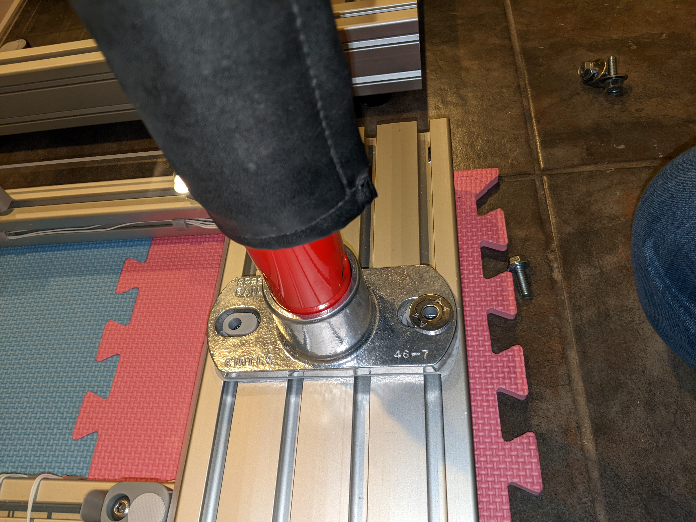

# FSR Dance Pad with Aluminum Frame

# Acknowledgements

This pad is essentially a fork of the RE:Flex dance pad (V2), with FSRs and teejusb's firmware.

I initially set out to build a RE:Flex, but ultimately made some changes.

My goals were

1. reduce BOM cost
2. support an arcade-style bar
3. minimize pad height to accomodate a low ceiling in my basement

Many of my design decisions were inspired and informed by ideas in the original RE:Flex, and even where I am happy with my changes, I'm usually giving up some desirable property in exchange. In several cases, trying to alter the design just made me realize why it was done that way in the first place. :)

# Differences from RE:Flex

* My frame is built with 15 series aluminum extrusions, which are 1.5 inches wide (38.1 mm). RE:Flex uses 40mm extrusions. TNutz was the cheapest hardware supplier I could find in the U.S. by a significant margin, and they do not carry 40mm extrusions, so I converted the frame to 15 series.
* My frame is assembled with anchor fasteners. RE:Flex uses joining plates on the bottom as well as inside corner gussets. The anchor fasteners save a small amount of height since there are no screws and joining plates underneath. It also allows the whole frame to sit flat on a foam mat since the bottom is all flush. When the frame is supported only at the corners (by rubber feet), I find it sqeaks. The joining plate plus corner gusset combo may do a better job of resisting twisting forces. The anchor fasteners require fewer screws, but also require machining on the extrusions.
* My pads include a set of Pump it Up GX bars, which I was lucky enough to snag on eBay after someone in the RE:Flex Discord pointed them out. They are mounted with railing flanges I found that happen to be the right size to fit both the bar and the extrusion. This meant getting beefy 3" by 6" extrusions for the back of the pads, which looks cool but increased the cost. I was super pleased to find that it all fits together well and feels sturdy. It would probably be more comfortable if it was height-adjustable, wider, and an inch or two further forward, which the RE:Flex bar does all of, so I'm not sure if this change was worth it! It was fun to design though. If you are unable to source an arcade bar but wanted to keep this form factor, you could build your own bar with pipe and elbow connectors.
* I modified the active and inactive panels to be flush with each other. RE:Flex inactive panels are 1mm higher than the active panels. This is nice for playing in socks, and less so in shoes since I can't feel where the panels are.
* Single-piece inactive panel standoffs. RE:Flex standoffs have some pieces that can be reused when switching from inactive to active panels, or iterating on the design. I came up with something that uses a little less plastic and can be printed in a single piece. It's also symmetrical so I don't need to worry about "left" and "right" versions. It sacrifices something in aesthetics since it looks a lot different from the active panel standoffs.
* Completely different electronics. The RE:Flex lighting looks amazing and its load cell based sensors have greater range and precision than the FSRs in my pad. However, due partly to the sweet lights and partly to semiconductor shortages, the cost of the RE:Flex electronics was very high in mid-2021, if you could even get all the parts. For a while I wanted 9 active panels, which RE:Flex didn't support yet (and still doesn't as of January 2023, but it is planned eventually).

# Other Designs

RE:Flex https://reflex.dance/

teejusb's FSR software https://github.com/teejusb/fsr

Dance pad by root670 https://github.com/root670/dance-pad

Bandit's travel pad (Build This Travel Pad) https://www.youtube.com/watch?v=y6wGYLE0YI4

Azirixx's build of Bandit's travel pad https://github.com/azirixx/easy-travel-pad-build

Sereni's FSR dance pad https://sereni.github.io/fsr-pad-guide/

Dom ITG's FSR dance pad https://www.youtube.com/playlist?list=PL2vUwLUVuyIy4CD8DEwS7oZ_Y41vyYWWy

Nato's metal travel pad https://github.com/natologic/MetalTravelPad

# Cost

I built two pads in the USA between 2021 and 2022 for around $1750 total.

# Bill of Materials

Frame Extrusions:
| Quantity | Profile            | Length   | Machining      |
| -------- | ------------------ | -------- | -------------- |
| 2        | 1515 (1.5" x 1.5") | 33 3/8"  | 4x counterbore |
| 2        | 1530 (1.5" x 3.0") | 33 3/8"  | 4x counterbore |
| 2        | 1530 (1.5" x 3.0") | 40 7/8"  | none           |
| 1        | 1530 (1.5" x 3.0") | 33 3/8"  | 6x counterbore |
| 1        | 3060 (3.0" x 6.0") | 33 3/8   | 6x counterbore |

Frame Fasteners:
* 4 double anchor fastener assemblies for 1515 struts
* 4 wide double anchor fastener assemblies for 1530 struts
* 12 single anchor fastener assemblies for front and back

Frame support:

* Foam or rubber mat to support pad

  OR

* 4 rubber feet, 4 screws, 4 t nuts

  OR

* 4 leveling feet of some kind

Bar Assembly:
* 1 Pump It Up bar or DIY bar (use nominal 1 1/4" pipe, outer diameter of 1.66")
* 2 Hollaender® - Safety Rail Fitting - 1-1/4in. Base Flange Strctrual Slip-on Fitting
* 4 t nuts, 4 washers, 4 screws (5/16"-18 7/8"long)
* 2 3D printed screw aligners

Panels and standoffs:
* 9 11" x 11" x 0.472" (12mm) cast acrylic panels
* 36 t-nuts and 36 5/16-18 x 1" Button Head Socket Cap Screws to attach standoffs
* 20 3D printed inactive panel standoffs
* 16 3D printed active panel FSR holders
* 16 3D printed active panel standoffs
* 16 3D printed active panel standoff holders
* 16 rubber bumpers with adhesive backing, 1/2" OD, 1/16" thick
* 36 pairs of hook and loop fastener circles, 20mm diameter (36 hook, 36 loop)

Sensors and electronics:
* 1 Teensy LC with pins
* 1 10ft USB micro cable
* Some 330 ohm resistors, the exact value isn't that important, anything 100 ohm to 1000 ohm is probably usable.
* 22awg solid core hookup wire
* 1 Solderless breadboard
* 16 Interlink FSR 402 Short FSRs with female connector with housing
* 1 3D printed breadboard platform
* 2 t nuts and 2 screws (5/16"-18 5/8" long) for breadboard platform
* Small zip ties
* 3D printed wire clips (STL missing, I will add it if I can find it)

Tools:
* 3D printed hook and loop fastener aligners
* 3D printed strut spacers
* 3D printed standoff spacers
* Ball-end hex allen keys
* Wire cutters
* Wire strippers
* Deburring tool

# Build Instructions

Up front you'll need a 3D printed spacing tool for the struts and a round hex ball wrench.

First gather your parts and deburr them. I used needle nose pliers to pull off the big chunks and deburring tool to smooth out some rough edges. The anchors will not fit properly if there is too much debris. Remember that the deburring tool has two different angles on it and dragging it in one direction will cut deeper. I didn't find this to be as big of an issue as on plastic parts but it is still useful to be aware of.

Lay out your extrusions as they will be arranged. Check their orientation. Maybe some are scratched. Decide where you want the scratches to go.

If you are using slide-in t nuts to attach the bar, feet, panel standoffs, breadboard platform, or any other accessories, insert them all now! They can't be added after joining the extrusions together. Roll-in t nuts are more expensive, but very convenient since they give you flexibility in the order of assembly or to add things on later. I used some heavy duty slide-in t nuts for the bar which I inserted at this point.

Gather your anchor fastener assemblies. Make sure they all match up and you have enough.

Assemble the anchor fasteners on the ends of the extrusions that have been machined to fit them. Pay attention to the direction of the t nuts. I put them on backwards a few times. Easy fix but annoying. Screw them together just slightly; they need to slide into place.

Slide the four struts into the back and front extrusions. Or, depending on your perspective, slide the back and front pieces onto the struts. I had to loosen some of the screws a little bit; if they are too tight, the extrusions will not slide together.

Now attach the left and right sides by sliding them on. In the pictures, I have only one side, because I am sharing a center piece between the player one and player two pads.

Once the outer pieces are slid on, evenly distribute the struts using the 3D printed spacer. Speaking from my experience, I recommend moving all of the struts into place before tightening any of them, as they will get progressively harder to adjust as more of them are tightened.

Realize that everything may not be perfectly square at this point, so the struts may be farther apart at one end than the other. Check the spacing at both ends of the struts, not just in the center.

The next part is a little tricky. Some fasteners are now unreachable: The outer extrusions block access to the screws on one side of the 1515 struts.

Fisrt, gently tighten the outside pieces, push the 1515 struts firmly against them, and tighten the screws on the inner sides of the 1515 struts that you can reach.

Next, remove the outer extrusions to get access to the screws that were blocked and tighten them.

This is also a good time to tighten the rest of the screws on the two middle struts.

Now put the sides back on, and tighten those as well. Note once again that in these pictures, one side is missing because the two pads will share an extrusion in middle.

Here we have the spacers/supports for the inactive panels. They align to the frame as well as to each other using a printed spacer (this is a different part than the spacer used to align the struts). They could be made more compact, but I wanted to leave enough room so that I could use the same hook and loop dot spacing if I ever upgraded to load cells.

Roll in the t nuts and screw the standoffs loosely in place. Align using the spacer, then tighten them in and apply the hook and loop dots. I put the hook dots on the standoffs and the loop dots on the panels. The dots go a little off center on the standoffs, aligned to the outer corners.

The panels come with slightly sharp edges from the saw cut. I chamfered the edges of my panels with a router at 45° angle. I have heard other people used sandpaper just to dull the sharp edges. The router was not difficult to use, but it's not strictly required and it was quite loud and somewhat messy.

Remove the protective film. Apply hook and loop dots (loop side) using the printed spacers. Line up the dots and place the panel on top of the standoffs!

Now the adapters for some active panels. These are redesigned from scratch to fit FSRs but are thoroughly inspired by the load cell holders on the RE:Flex dance pad. I made sure the spacing was such that if I one day wanted to replace them with the load cells from a RE:Flex board, a remixed RE:Flex load cell holder for 15-series extrusion would line up with the hook and loop dots in the same place. I'm using small round Interlink 402 short FSRs. Standard, not the X or UX variant (X and UX also work, but cost more).

Add the rubber bumper to the bottom of the standoff part. There is a circle to help locate the center.

The FSRs come with adhesive applied to the bottom, but I am not sticking them in place. The FSR fits into a carefully-sized cutout that keeps it from moving around.

Add the hook and loop dot to the top of the standoff. Fit the parts together and screw them in using a t nut. Take care about mirroring the parts and which one is left and right.

You can use the same 3D printed spacer as for the inactive panel standoffs.

Apply hook and loop dots (loop side) to another panel. It fits on top the same as with the inactive standoffs. It will have to come off to install the wiring, but feel free to do a test fit here.

As an aside, I sanded the underside of some panels with an orbital sander to give them a frosted look. I also sanded the top of the center panel, which makes it less smooth and perhaps counterintuitively helps reduce friction when playing in socks.

Install the rest of the active and inactive standoffs.

It's possible to have a perfectly functional pad with only two FSRs per panel, on the inner corners (bordering the center panel).

My first pad has two FSRs per panel, my second has 4 FSRs per panel. Both work well. Using 4 FSRs per panel results in more uniform sensitivity across the panel, especially on the far edge, which can be useful for doubles play. The difference is not that dramatic though.

My solderless breadboard came with an adhesive pad on the bottom, which I used to stick it to a 3D printed platform.

I recommend getting the firmware installed and testing it at your desk before proceeding to wire up the pad. This is currently outside the scope of the guide, but I may add more information about firmware and breadboard layout later.

To avoid having to crimp a connector onto every wire, I used solid core hookup wire, which fits snugly into both the female connector on the FSR and into the solderless breadboard.

After plugging in the wires, use the provided mounting points to secure them with small cable ties.

I designed these clips that snap into the slot of a 15 series extrusion. Use a generous amount of these to help keep the wires tidy.

At first, I was routing the wires so that they did not cross gaps in the middle of panels, but later gave up on this plan since it was using so much extra wire. Use whatever approach feels right to you here.

If you tested your electronics in advance, you may have a working pad at this point! Plug it into a computer and test to see if everything is connected correctly and whether any panels are sticking. I had to file a few rough edges down on the 3D printed parts to make sure everything could move smoothly.

You can also take this opportunity to calibrate the trigger threshold with a 5 or 10 pound weight.

At this point you need some way to route the USB cable to the outside of the frame. You have a couple of options.

If you install feet under the frame, you can run the cable through the gap underneath.

I used rubber bumpers for feet, that each attached with a screw to a t nut on the underside of the frame. I had a large 3D printed shim for one corner since my floor was not level at all. 

If you place the pad on foam or rubber surface like a playroom mat, gym floor mat, or horse stall mat, you may prefer to route the cable through a hole in the frame.

To make room for the cable to fit, you can remove two of the anchor fasteners on the front of the frame, as I did. This leaves space to route the cable through. I probably wouldn't recommend this if the pad is only supported by feet at the corners, since it will make the frame less rigid.

Finish installing the rest of the acrylic panels if you haven't, and the pad should be ready for nobar play! You may wish do some playtesting at this time before adding the bar.

I am not a Pump It Up expert, but I understand that the bars I got are from a Pump It Up GX cabinet. There is another piece (which I do not have) that bolts to the dancing stage, and I am using railing flanges for structural pipe instead. The flanges are not designed to fit precisely this size tube or specifically to attach to t slot extrusions, but the dimensions are close enough to work well. I chose this flange in particular because of the spacing between the mounting holes.

The 3D printed parts here are to help keep the screws aligned in the oversized holes, and also to help prevent scratches on the 3060 extrusion. Because the slots in the flanges are so wide, I added some thick washers to increase the contact area. I used different screws and t nuts for the bar mount than for the rest of the pad. I was going for something more heavy duty. It has worked well, but it may be overkill.

Install both flanges on the bar before screwing them down. Make sure the set screws on the flanges are loosened. It's a snug fit. I found that running a deburring tool around the top opening of the flange also helped slightly with the fit.

Place the screw aligners under the flanges and set the bar on top of the back extrusion. Slide the t nuts into place under the holes.

Add the washers and screws. If you leave them a little loose, you can slide the bar sideways to adjust the position before tightening them all down.

Tighten the set screws on the flanges.

Now enjoy some dance gaming on your new dance pad!

